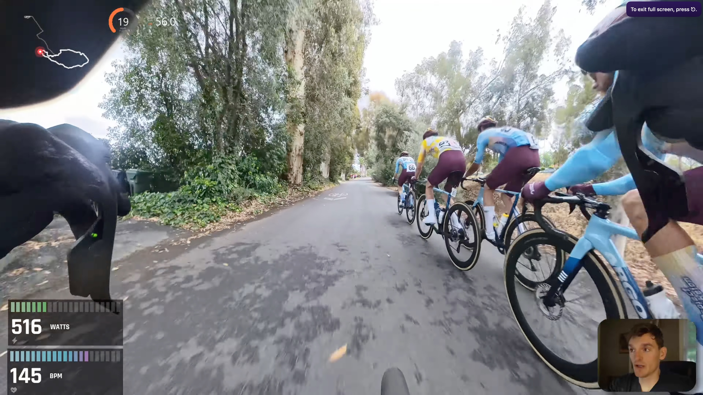

# Templates

Community templates are browsable and installable directly from within Cyclemetry via **Templates → Browse Community Templates**.

## Showcase

<!-- SHOWCASE_START -->

| Template | Inspiration | Preview |
| --- | --- | --- |
| **Aaron** | — |  |
| **Crit** | — |  |
| **Jeff** | — |  |
| **Safa** | — |  |
| **Will** | — |  |

<!-- SHOWCASE_END -->

## Folder structure

Each template lives in its own subdirectory named with lowercase snake\_case:

```
templates/
  templates.json       ← showcase metadata used by GitHub README + website
  my_template/
    my_template.json   ← overlay configuration
    preview.jpg        ← 1920×1080 preview screenshot (required)
    README.md          ← optional: authorship, notes, compatible activity types
```

Add every public template to `templates/templates.json`. That manifest is the single source for display names, showcase order, and optional inspiration credits used by both this README and the website templates page. The JSON filename must match the folder name exactly.

Optional inspiration credit format:

```json
{
  "id": "my_template",
  "displayName": "My Template",
  "inspiration": {
    "label": "Creator video title",
    "url": "https://www.youtube.com/watch?v=..."
  }
}
```

## Submitting a template

1. **Fork** the repository and create a branch.
2. Create a new folder under `templates/` using lowercase snake\_case (e.g. `templates/my_template/`).
3. Add your template JSON at `templates/my_template/my_template.json`.
4. Add a `preview.jpg` — a 1920×1080 screenshot of the overlay rendered over a real activity. This is required; templates without a preview won't appear in the in-app browser.
5. Add an entry to `templates/templates.json`. If the design was inspired by a video, add an `inspiration` object with `label` and `url`.
6. Optionally add a `README.md` inside your folder with your name/handle, a description, and any notes about which activity types or data fields the template expects.
7. Open a **pull request** against `main`. Include a brief description of the template and link to any video it was designed for.

Templates are reviewed for correctness (valid JSON, reasonable field names) and that the preview accurately represents the overlay. Once merged they are immediately available to all users via the in-app browser.

## JSON schema

See [CLAUDE.md](../CLAUDE.md) for a high-level overview of the app architecture. A full schema reference is planned — for now, use an existing template as a starting point and adjust field values.
